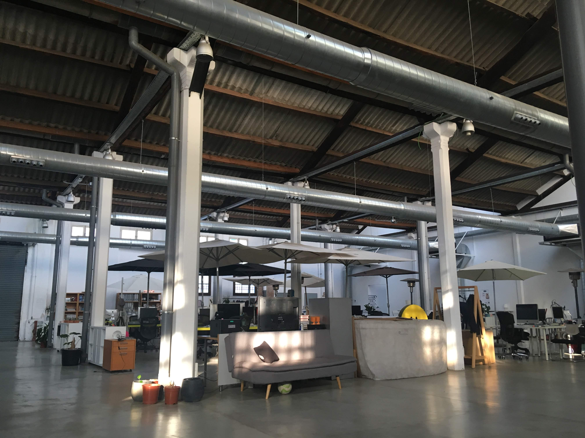
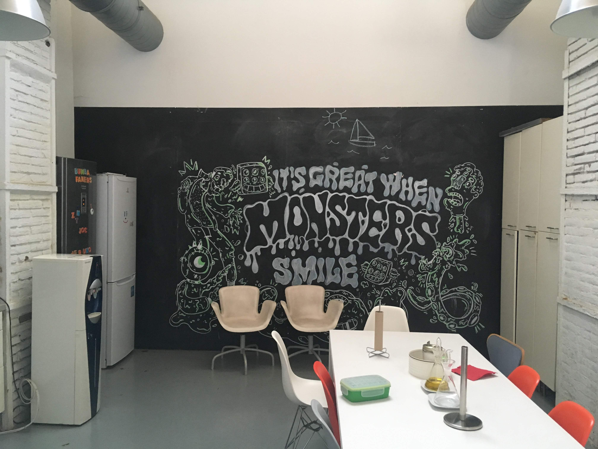

Hoy es mi primer día trabajando para Trioteca. Comparten espacio en las oficinas de Herraiz Soto.

El ambiente industrial mola mucho y la gente que trabaja allí parece muy agradable. Algunos llevan a sus perros y de vez en cuando arranca una trifulca de ladridos.

Necesitan ayuda con el backend. Tienen montado un Laravel apoyado en Docker. Hay mucho trabajo por hacer, muy buenas ideas, pocas manos y menos tiempo.

He podido entender el código rápidamente y ya tengo a medias el primer desarrollo. Lo más difícil será entender todos los conceptos que se manejan en una hipoteca.

